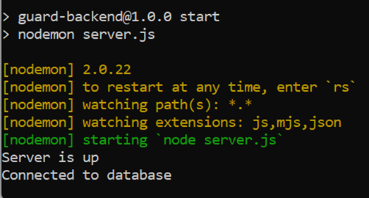
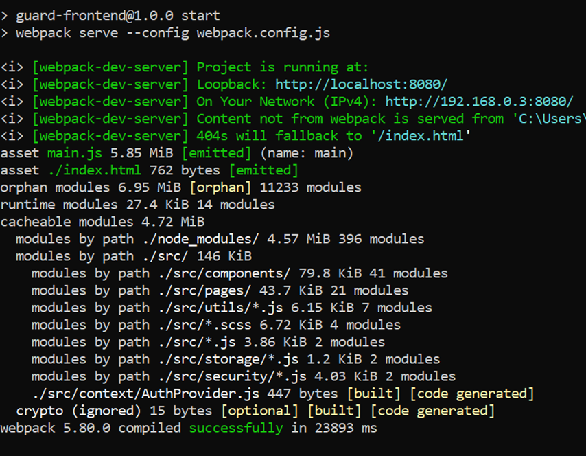
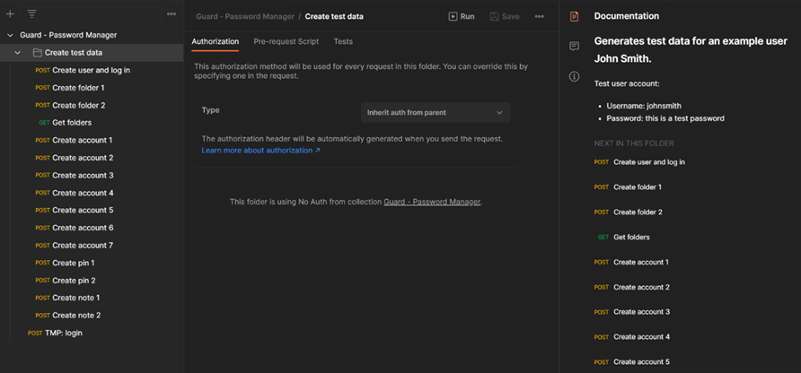
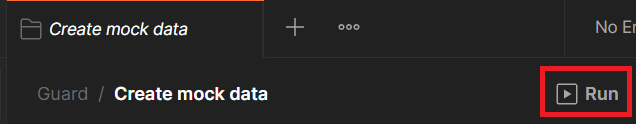
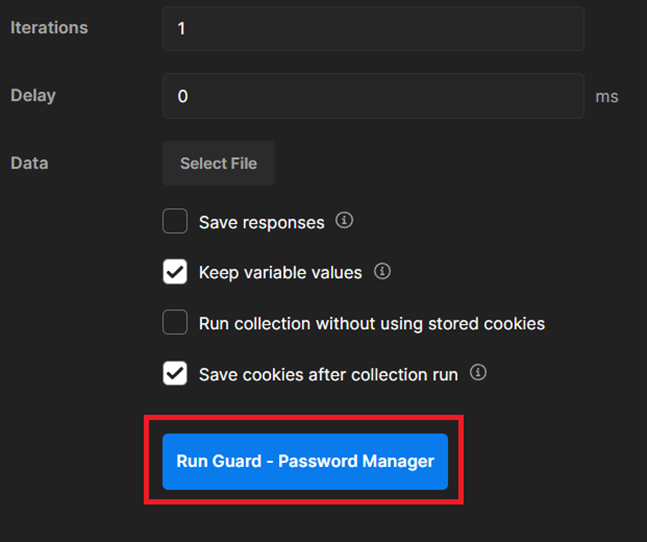
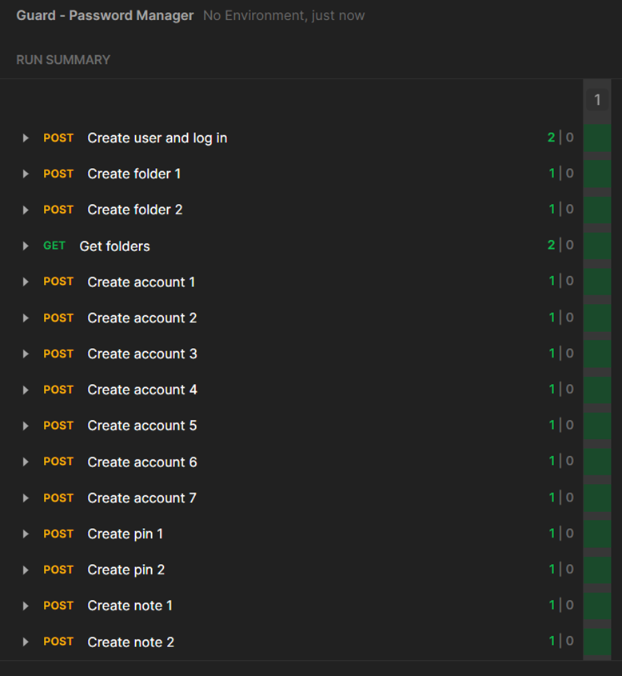
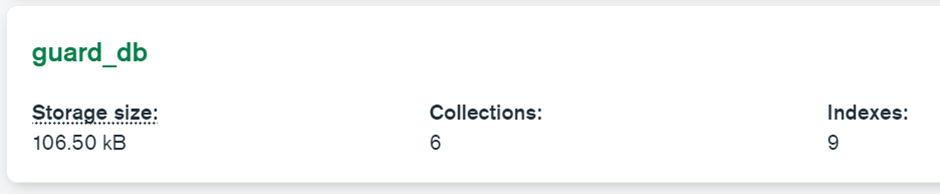

# Guard: A User-Centric, Security-Focused Modern Password Management Application

Guard is an application developed to help users create strong customisable and optionally memorable passwords,
to securely store and retrieve passwords and other sensitive user information, and to aid users in managing
their password security through health overviews and password strength evaluations.

Final Report: [Report.pdf](report/Final-Report.pdf)

Kanban Board: https://trello.com/b/oMeNIkgJ/guard-project-kanban-board

Project on Personal GitHub: https://github.com/BrendonCurmi/Guard

Project on University GitHub: https://github.com/University-of-London/project-module-BrendonCurmi

### Required Software
- Node.js (https://nodejs.org/) – dependency manager and application launcher
- MongoDB (https://www.mongodb.com/) – database software
- Postman (https://www.postman.com/) – REST API testing and mock data creation

### Setup
To set up the application and populate the database with example data:
1. After cloning the project to a local device, use a command prompt to enter the backend, install dependencies, and start the backend:
   ```
   $ cd Guard/backend
   $ npm install
   $ npm start
   ```

    This should start the backend service on port 4000, and connect to the MongoDB database:
    

    Figure 1: Successful start of backend service.

2. In another command prompt, enter the frontend, install dependencies, and start the frontend service:
   ```
   $ cd Guard/frontend
   $ npm install
   $ npm start
   ```

    This should start the frontend service on port 8080:
    

    Figure 2: Successful start of frontend service.

3. Import test data into MongoDB:
   1. In the /tests folder, there is a file called `Guard - Password Manager.postman_collection.json` which is an export of a Postman collection.
   2. Import the collection file into Postman:
      

      Figure 3: Project collection imported into Postman.
   3. Run the `Create mock data` folder:
      

      Figure 4: Run folder to create mock data.
      

      Figure 5: Run folder to create mock data.
      
      This should successfully execute all requests, with all tests passing:
      

      Figure 6: Data is imported successfully with all tests passed. 

      This should create the collections and data in MongoDB, which can be viewed using MongoDB Compass:
      

      Figure 7: Successful creation of database in MongoDB.

4. Visit the frontend on http://localhost:8080/login and log in using the test credentials:
    - Username: johnsmith
    - Password: this is a test password
